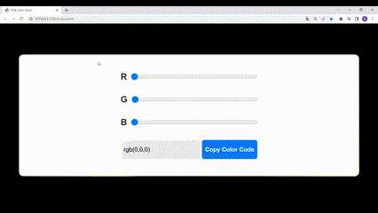

# RGB Color Generator
This project aims to create an RGB color slider. It is developed using HTML, CSS, and JavaScript. The page contains three sliders representing the red (R), green (G), and blue (B) color components. Through the sliders, the user can select their desired color tones. 

As the values on the color sliders change, the selected color values are automatically updated, and the resulting RGB color code represents the background color of the page. Additionally, the color code is presented to the user and can be copied by the user. 

The JavaScript code in the project runs the generateColor() function whenever the slider values change. This function creates an RGB color code based on the selected color values, displays the code on the screen, and updates the background color. Furthermore, when the user clicks the "Copy Color Code" button, the copyColorCode() function is triggered, copying the color code to the clipboard. 

This project provides users with an easy way to select RGB colors and obtain the corresponding color code. 
Preview:  
 
